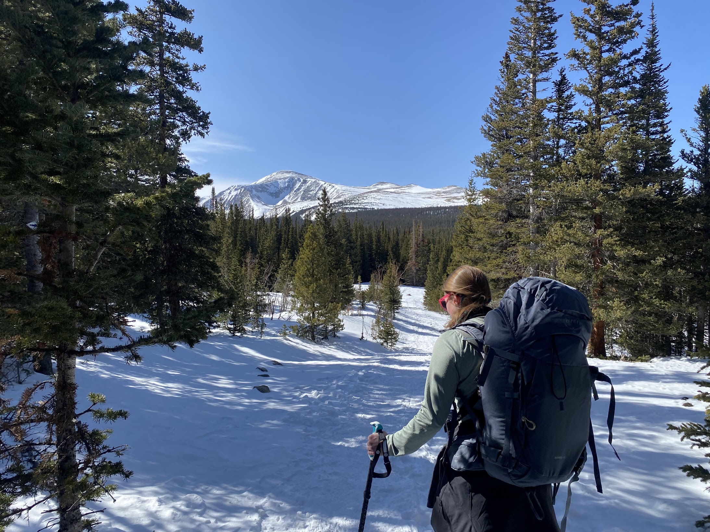
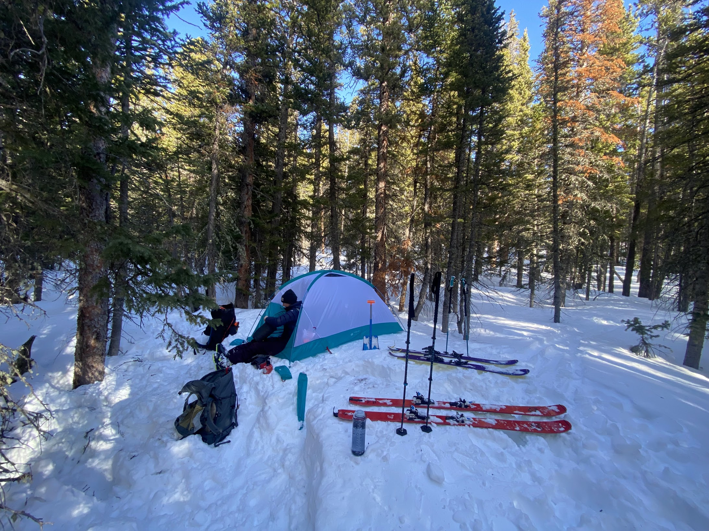
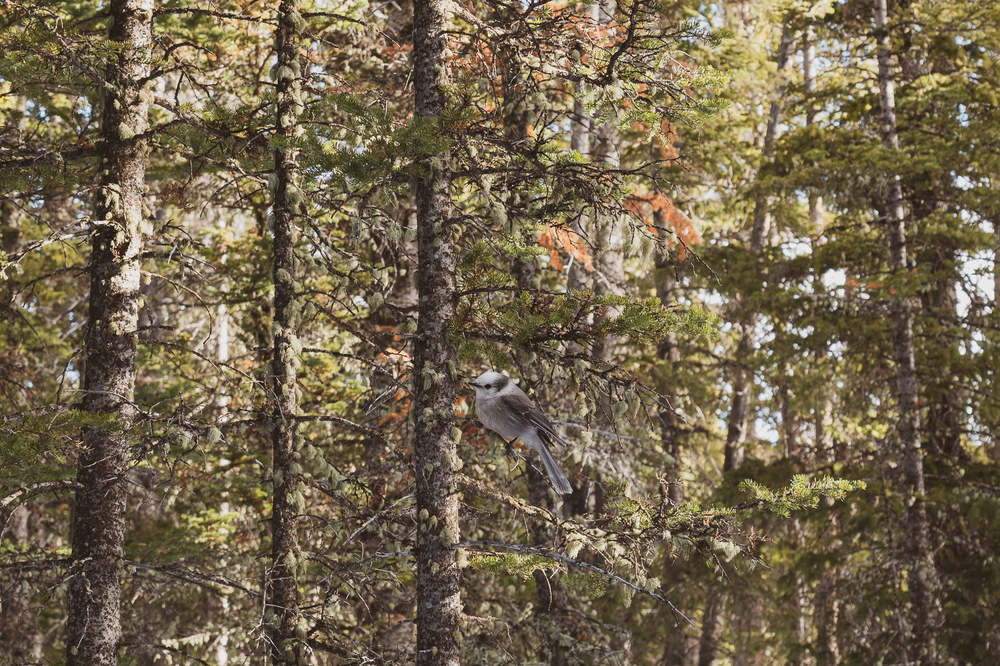
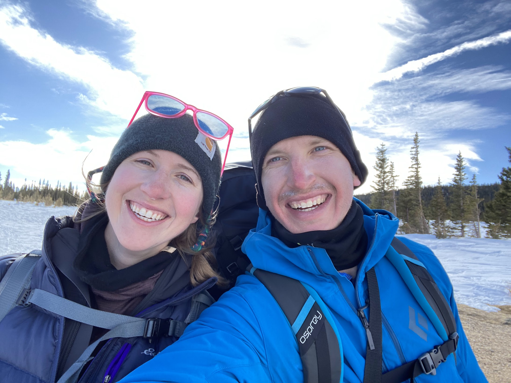
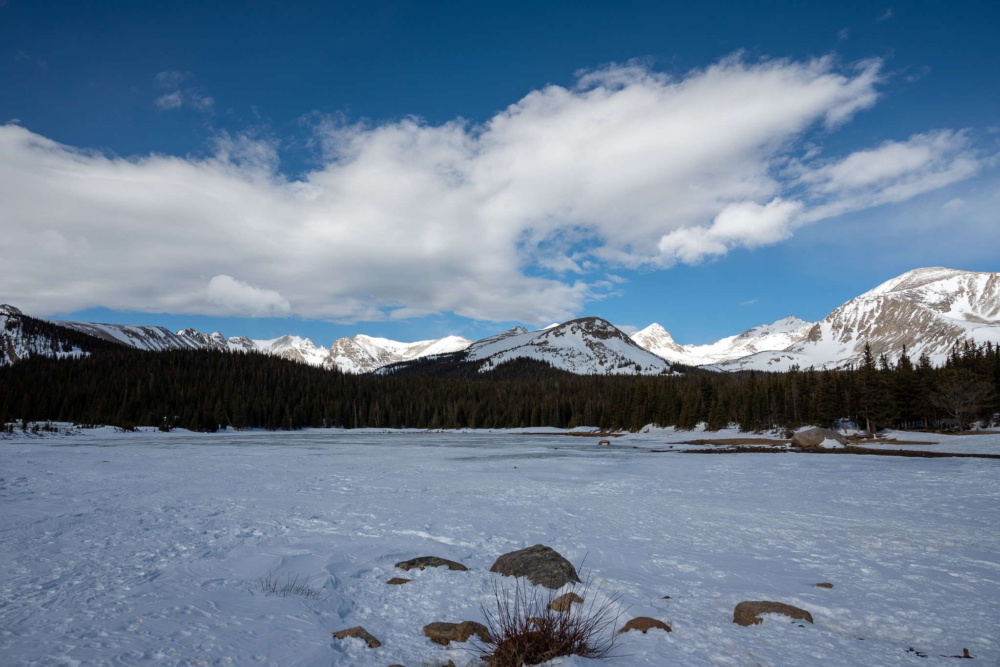
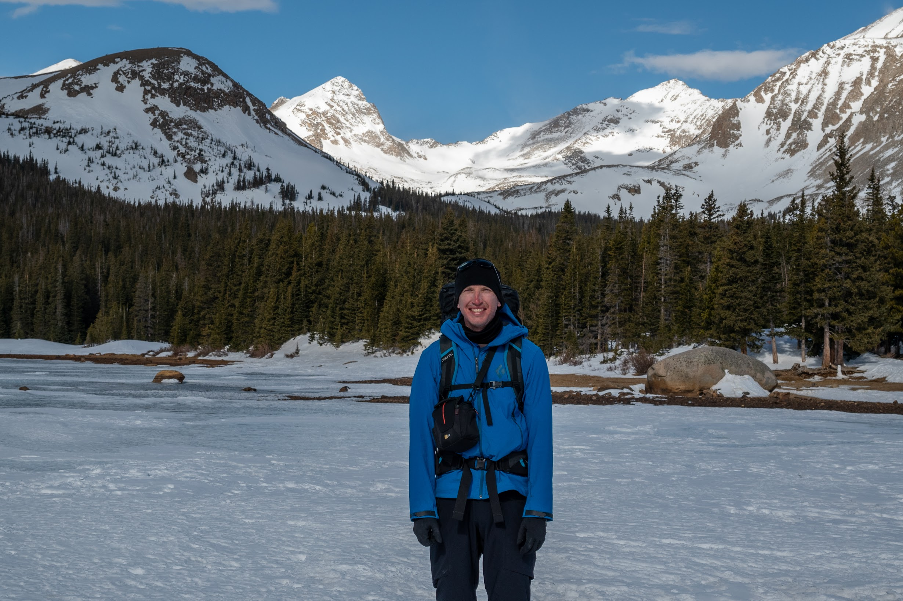
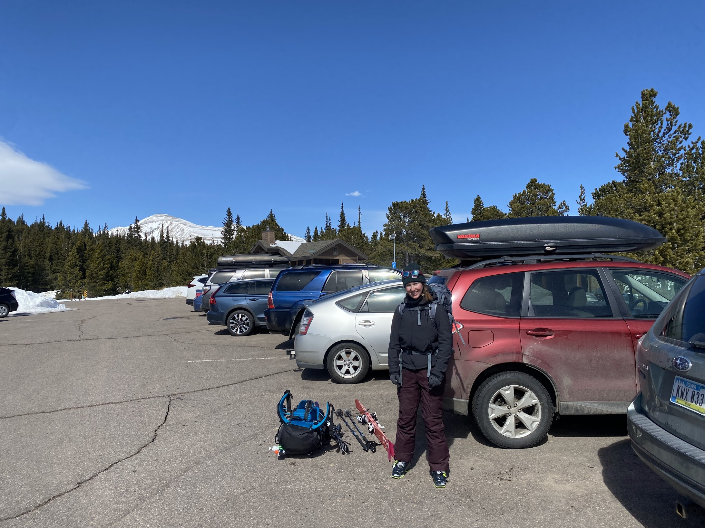

### 

We survived our first winter camping trip!!! It was a whirlwind, but one of the coolest things I've done so far.

We hiked about 2 miles on skins to find a spot to camp near Brainard Lake, in the trees to block us from the wind. The hike really wasn't bad, and I think it was the perfect amount for a first trip. It was beautiful on the trail, and snowy the whole way up. We decided on a camp site at around 4pm, and quickly realized the challenge of camping on faceted snow. It was so easy to get around on skis, but the first step in boots took us about 2 feet down into the snow.... definitely a shock. Andrew dug out areas to bury the stakes, and I tried to help where I could. We got the tent all set-up, then Andrew started boiling water for dinner, and we were both ready to get into our sleeping bags pretty much immediately. We had Chicken Alfredo from the Backpacker Pantry, and I ate so much. Just having something warm felt amazing, and I started to not totally regret this decision to camp on the snow. Once we ate, we got ready for bed, and oh man, that sleeping bag was the best. I honestly slept pretty well -- the trees really blocked the wind, and it was quiet enough to sleep, but not so quiet to hear every little noise. 

We got up around 8AM and started getting things together to pack up. Andrew brought Clif Bar gel shots with caffeine, and it was a lot easier to have than coffee. When I had mine, a bird came incredibly close to see what was going on, left, then brought back a friend. It was so awesome! They were right above our heads, checking us out, which was a little intimidating. Andrew and I just tried to look up and see the species of bird, either a Canada Jay or Clark's Nutcracker. 

We headed out around 9-9:30 to hike to Brainard Lake. It didn't take very long, and we used the snow-covered road instead of a trail. The views were amazing, seeing Mount Toll and Andrew showing where he skied was pretty mind-blowing. The weather was close to perfect, and I'm so glad we did that hike. We sat on a bench for a little bit, eating our Stroopwafels and taking a break, then started on our way back to the car. The road back was a bit of a challenge, switching from skins to skiing, to booting, to skiing, but it was good practice for future ski trips. 

Making it to the car was bittersweet! I wish we could've spent more time out there, but it was nice to take the pack and all of the ski gear off. We drove back via Lefthand Canyon, lots of cyclists, and a gorgeous day to do it. Once we got home, I just sat and looked at pictures until it was time to pick-up Plato from boarding. At like 3:30, I got a notification from the Boulder County Emergency system of a wildfire near NCAR, which is so weird, we were just talking about taking the bikes up there Sunday. I could see the smoke driving to Erie -- it looked really white, and thankfully not huge. Since we were going to go out with Erin and Andrew that night, we decided to keep Plato at the kennel in case something crazy happened with the fire. 

I had the best day, and week really. Going out was a lot of fun, especially after traveling most of the week. We went to Number Thirty Eight in Denver, definitely feeling like we were too old for it at first, but it ended up being a really cool spot, and the hot chicken sandwich was to die for. Then we came back and watched the classic Beirut's Soiree de Pocheon (after talking about Beirut that night). What a day :)